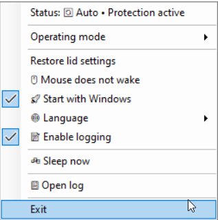
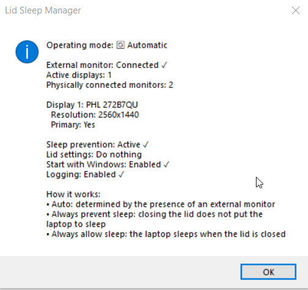

# SleepMngr

**English** | [Русский](README.ru.md)

[](https://github.com/dpolarov/tray-sleep-manager/actions/workflows/build.yml)
[](https://github.com/dpolarov/tray-sleep-manager/releases/latest)
[](https://github.com/dpolarov/tray-sleep-manager)

SleepMngr is a small Windows tray utility for laptops used with external monitors. It automatically changes sleep protection and the lid-close action so a laptop can keep running in clamshell mode, while still returning to normal sleep behavior when the external display is disconnected.




## Download

The easiest way to use SleepMngr is to download the latest release:

**[Download the latest release](https://github.com/dpolarov/tray-sleep-manager/releases/latest)**

Two Windows x64 packages are published:

- **`SleepMngr-win-x64-standalone.zip`** — recommended for most users. Includes the .NET runtime and does not require a separate installation.
- **`SleepMngr-win-x64-compact.zip`** — much smaller, but requires the **.NET 8 Desktop Runtime** to be installed.

There is no installer. Extract the ZIP and run `SleepMngr.exe`.

See [CHANGELOG.md](CHANGELOG.md) for release notes. The `main` branch may contain changes that are newer than the latest published release.

## Features

- Automatic detection of connected and active displays.
- Automatic clamshell behavior when an external monitor is connected.
- Three operating modes: Automatic, Always prevent sleep, and Always allow sleep.
- Lid-close action management with the original AC/DC values saved and restored.
- `SetThreadExecutionState` sleep prevention while protection is active.
- Modern Standby (S0 Low Power Idle) support.
- Multiple fallback sleep methods for classic S3 systems.
- Automatic sleep after an external monitor is disconnected while the laptop is in clamshell mode.
- Optional mouse-wake disabling.
- **Start with Windows** option using the current user's Windows Run registry key.
- Russian and English UI with runtime language switching.
- Optional structured logging, **disabled by default**.
- Detailed status window showing monitor and power-state information.
- Single-instance behavior: starting a new copy replaces the existing instance.
- Automated Windows builds and GitHub Releases.

## Operating modes

### Automatic — default

SleepMngr follows the current monitor configuration:

- **External monitor connected** → sleep prevention is enabled and the lid action is set to **Do nothing**.
- **No external monitor** → sleep prevention is disabled and previously saved lid settings are restored when applicable.

Automatic mode also contains two clamshell safety behaviors:

- If the lid is closed and the display remains off for at least **10 seconds**, SleepMngr triggers sleep.
- If an external monitor is disconnected while the laptop was operating in clamshell mode, SleepMngr triggers sleep after about **3 seconds**.

### Always prevent sleep

Sleep protection stays enabled regardless of monitor configuration. SleepMngr requests continuous system/display availability and sets the lid-close action to **Do nothing**.

### Always allow sleep

Sleep prevention is disabled regardless of monitor configuration. If SleepMngr previously changed the lid-close action, it restores the saved values.

## Tray menu

The current tray menu contains:

- **Status** — opens detailed display and power information.
- **Operating mode**
  - `Automatic`
  - `Always prevent sleep`
  - `Always allow sleep`
- **Restore lid settings** — manually restores the saved lid-close action.
- **Mouse does not wake** — disables/enables mouse wake through `powercfg`.
- **Start with Windows** — enables/disables autostart for the current Windows user.
- **Language** — switches between English and Russian immediately.
- **Enable logging** — turns diagnostic file logging on/off.
- **Sleep now** — immediately requests system sleep.
- **Open log** — opens the existing log file.
- **Exit** — restores/cleans up application state and exits.

Double-clicking the tray icon opens the status window.

## Start with Windows

The autostart option writes the current `SleepMngr.exe` path to:

```text
HKEY_CURRENT_USER\Software\Microsoft\Windows\CurrentVersion\Run
```

Value name:

```text
SleepMngr
```

Because it uses `HKEY_CURRENT_USER`, enabling or disabling autostart normally does not require administrator rights. The registry write is verified after the change. If the executable is moved to another folder later, toggle **Start with Windows** off and on again so the saved path is updated.

## Logging

Logging is **off by default** and the choice is persisted between launches.

When enabled, SleepMngr records mode changes, monitor/display changes, lid operations, mouse-wake operations, autostart changes, `powercfg` commands and results, session/power events, `Sleep now`, and automatic sleep triggers.

Files are stored under:

```text
%AppData%\SleepMngr\
```

Main files:

```text
sleep_log.txt   diagnostic log
logging.txt     logging on/off setting
language.txt    selected UI language
```

Logging failures never stop the tray application.

## Permissions and `powercfg`

SleepMngr is designed to run as a normal Windows user and does **not** automatically request elevation.

However, Windows may reject some `powercfg` operations depending on the machine, security policy, OEM configuration, or user permissions. This is especially relevant to lid-action changes and wake-device configuration.

SleepMngr handles these failures as non-fatal errors:

- the application keeps running;
- the command exit code, stderr, timeout, or process-start error can be logged;
- lid changes are verified after writing;
- original lid values are never guessed if they cannot be read;
- partial mouse-wake changes are rolled back where possible.

If a feature does not apply correctly, enable logging and try the same operation once. Running as Administrator can also help determine whether the problem is permission-related.

## How lid settings are handled

SleepMngr uses Windows `powercfg` to write the lid-close action, but reads and verifies AC/DC values primarily through native `PowrProf.dll` APIs. This avoids relying on localized `powercfg /query` text.

Before changing the lid action, SleepMngr saves the current AC and DC values. It only treats the operation as successful after the resulting values have been verified.

## Sleep behavior

### Modern Standby (S0 Low Power Idle)

On systems that use Modern Standby, `Sleep now` turns the display off and lets Windows enter S0 Low Power Idle. This behavior has been tested on real Modern Standby hardware.

### Classic S3 sleep

On systems with classic S3 sleep, SleepMngr keeps the existing multi-method fallback strategy. Several Windows APIs and command-based methods are attempted because a successful process launch does not reliably prove that the machine actually entered sleep.

## Monitor detection

SleepMngr combines lightweight Windows display information with WMI data. The main monitor check runs every **2 seconds**.

WMI-derived monitor count and friendly-name data are cached for **10 seconds** and invalidated immediately after a Windows display-settings change event. This reduces background WMI traffic without making monitor connection/disconnection detection noticeably slower.

## Build from source

Requirements:

- Windows 10/11 x64
- [.NET 8 SDK](https://dotnet.microsoft.com/download/dotnet/8.0)

### Build scripts

From the repository root:

```text
build-compact.cmd      compact single-file build
build-standalone.cmd   self-contained single-file build
build-debug.cmd        development build
clean.cmd              remove build output
```

For a normal standalone build, run:

```bat
build-standalone.cmd
```

### PowerShell

Restore and build:

```powershell
dotnet restore SleepMngr.csproj
dotnet build SleepMngr.csproj -c Release
```

Compact single-file build:

```powershell
dotnet publish SleepMngr.csproj -c Release -r win-x64 --self-contained false -p:PublishSingleFile=true
```

Standalone single-file build:

```powershell
dotnet publish SleepMngr.csproj -c Release -r win-x64 --self-contained true -p:PublishSingleFile=true
```

Run the non-destructive CI self-test:

```powershell
dotnet run --project SleepMngr.csproj -c Release -- --self-test
```

The self-test checks error handling, including simulated non-elevated `powercfg` failures, without intentionally changing Windows power settings.

## Automated builds and releases

GitHub Actions builds both Windows variants on pushes and pull requests. Release builds run the same compile and self-test path before packaging.

A versioned release produces:

```text
SleepMngr-win-x64-compact.zip
SleepMngr-win-x64-standalone.zip
```

The workflow also creates the GitHub Release automatically.

## Troubleshooting

### The laptop still sleeps in "Always prevent sleep"

1. Open **Status** and verify that protection is active.
2. Enable **Logging**.
3. Switch to **Always prevent sleep** again.
4. Open the log and look for `LidActionManager` and `PowerCfg` entries.
5. If Windows reports access denied or another `powercfg` error, try running SleepMngr as Administrator to confirm whether permissions are the cause.

### External monitor is not detected

- Confirm that Windows sees the monitor in **Settings → System → Display**.
- Open SleepMngr **Status** and compare active and physically attached display counts.
- Disconnect/reconnect the monitor once; display-change events invalidate the WMI cache immediately.

### `Sleep now` does not work

Enable logging and run **Sleep now** again. On Modern Standby systems, look for an S0 Low Power Idle detection message. On classic S3 systems, the detailed trace shows the fallback sleep attempts.

### Start with Windows does not work

- Toggle **Start with Windows** off and on again.
- If the executable was moved, the toggle updates the saved path.
- Enable logging and repeat the operation if the registry change fails.

### Local build reports duplicate assembly attributes

Update to the latest `main`, then run:

```bat
clean.cmd
build-standalone.cmd
```

The main project explicitly excludes stale `SleepMngr.Tests/**` generated output so old local test artifacts do not get compiled into `SleepMngr.csproj`.

## Key source files

```text
Program.cs                  application entry point and single-instance lifecycle
TrayApplicationContext.cs   tray UI, modes, monitor transitions and auto-sleep logic
MonitorDetector.cs          active/physical monitor detection and WMI cache
PowerManager.cs             sleep prevention and sleep execution
PowerCfgRunner.cs           safe powercfg process execution and diagnostics
LidActionManager.cs         lid-close changes, save/restore and verification
LidPowerSettings.cs         native PowrProf lid setting reads
WakeManager.cs              mouse wake management
AutoStartManager.cs         current-user Windows autostart registration
Localization.cs             Russian/English UI selection
AppLog.cs                   optional diagnostic logging
AppSelfTest.cs              CI-safe self-test
IconGenerator.cs            tray icon generation
CHANGELOG.md                release history
```

## Release validation

Version 1.0.0 was manually tested on real Windows laptop hardware for:

- runtime English/Russian switching;
- `Sleep now` on Modern Standby;
- normal lid-close sleep;
- **Always prevent sleep** with the lid closed;
- external-monitor connect/disconnect detection and Automatic-mode switching;
- optional logging and `powercfg` diagnostics.

CI additionally validates build, self-test, compact publish, standalone publish, packaging, and release creation.