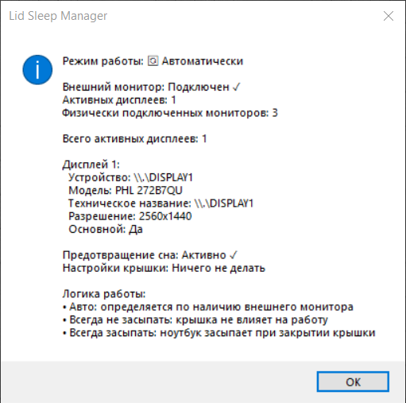
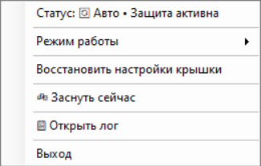

# SleepMngr

[English](README.md) | **Русский**

[](https://github.com/dpolarov/tray-sleep-manager/actions/workflows/build.yml)
[](https://github.com/dpolarov/tray-sleep-manager/releases/latest)
[](https://github.com/dpolarov/tray-sleep-manager)

SleepMngr — небольшая утилита для Windows в системном трее, предназначенная для ноутбуков с внешними мониторами. Она автоматически управляет защитой от сна и действием при закрытии крышки, чтобы ноутбук мог работать в режиме clamshell с внешним дисплеем и возвращался к обычному поведению после его отключения.




## Скачать

Самый простой вариант — взять готовую сборку из последнего релиза:

**[Скачать последний релиз](https://github.com/dpolarov/tray-sleep-manager/releases/latest)**

Публикуются два варианта для Windows x64:

- **`SleepMngr-win-x64-standalone.zip`** — рекомендуется большинству пользователей. Включает .NET Runtime и не требует его отдельной установки.
- **`SleepMngr-win-x64-compact.zip`** — намного меньше по размеру, но требует установленный **.NET 8 Desktop Runtime**.

Установщика нет. Распакуйте ZIP и запустите `SleepMngr.exe`.

Текущий стабильный релиз: **v1.0.0**. История изменений — в [CHANGELOG.md](CHANGELOG.md).

## Возможности

- Автоматическое определение подключённых и активных дисплеев.
- Автоматическая работа в clamshell-режиме при подключённом внешнем мониторе.
- Три режима: Автоматически, Всегда не засыпать и Всегда засыпать.
- Управление действием при закрытии крышки с сохранением и восстановлением исходных AC/DC значений.
- `SetThreadExecutionState` для предотвращения сна, когда защита активна.
- Поддержка Modern Standby (S0 Low Power Idle).
- Несколько резервных методов сна для классических S3-систем.
- Автоматический сон после отключения внешнего монитора в clamshell-режиме.
- Возможность отключить пробуждение от мыши.
- Русский и английский интерфейс с переключением без перезапуска.
- Структурированный лог, **по умолчанию выключен**.
- Подробное окно статуса с информацией о мониторах и состоянии защиты.
- Запуск только одного экземпляра: новая копия заменяет уже работающую.
- Автоматические Windows-сборки и GitHub Releases.

## Режимы работы

### Автоматически — режим по умолчанию

SleepMngr ориентируется на текущую конфигурацию мониторов:

- **Внешний монитор подключён** → включается защита от сна, а действие крышки устанавливается в **Ничего не делать**.
- **Внешнего монитора нет** → защита отключается, а ранее сохранённые настройки крышки восстанавливаются, если программа их меняла.

В автоматическом режиме есть ещё два защитных сценария:

- Если крышка закрыта и дисплей остаётся выключенным не менее **10 секунд**, SleepMngr инициирует сон.
- Если внешний монитор отключён, когда ноутбук работал в clamshell-режиме, SleepMngr инициирует сон примерно через **3 секунды**.

### Всегда не засыпать

Защита остаётся включённой независимо от наличия внешнего монитора. SleepMngr запрашивает постоянную доступность системы/дисплея и устанавливает действие крышки в **Ничего не делать**.

### Всегда засыпать

Защита от сна отключена независимо от конфигурации мониторов. Если SleepMngr ранее менял действие крышки, сохранённые значения восстанавливаются.

## Меню в трее

Текущее меню содержит:

- **Статус** — подробная информация о дисплеях и состоянии питания.
- **Режим работы**
  - `Автоматически`
  - `Всегда не засыпать`
  - `Всегда засыпать`
- **Восстановить настройки крышки** — ручное восстановление сохранённых значений.
- **Мышь не будит** — отключение/включение пробуждения от мыши через `powercfg`.
- **Язык** — мгновенное переключение между русским и английским.
- **Вести лог** — включение/отключение диагностического файла.
- **Заснуть сейчас** — немедленный запрос перехода в сон.
- **Открыть лог** — открывает существующий файл лога.
- **Выход** — выполняет очистку/восстановление состояния и закрывает приложение.

Двойной клик по иконке открывает окно статуса.

## Логирование

Логирование **выключено по умолчанию**, выбранное состояние сохраняется между запусками.

При включённом логе записываются смена режима, подключение/отключение дисплеев, операции с крышкой, настройка пробуждения от мыши, команды и результаты `powercfg`, события сессии/питания, `Заснуть сейчас` и автоматические переходы в сон.

Файлы находятся в:

```text
%AppData%\SleepMngr\
```

Основные файлы:

```text
sleep_log.txt   диагностический лог
logging.txt     включено/выключено логирование
language.txt    выбранный язык интерфейса
```

Проблемы с записью лога никогда не должны останавливать приложение.

## Права и `powercfg`

SleepMngr рассчитан на работу от обычного пользователя Windows и **не запрашивает повышение прав автоматически**.

При этом Windows может запрещать отдельные операции `powercfg` в зависимости от компьютера, политик безопасности, OEM-настроек или прав пользователя. В первую очередь это относится к действию крышки и настройке устройств пробуждения.

Такие ошибки обрабатываются как нефатальные:

- приложение продолжает работать;
- в лог можно записать exit code, stderr, timeout или ошибку запуска процесса;
- после записи настройки крышки проверяются повторно;
- исходные значения крышки не подменяются предположениями, если их не удалось прочитать;
- частично применённые изменения mouse wake по возможности откатываются.

Если какая-то функция не применяется, включите лог и повторите действие один раз. Запуск от Administrator также помогает понять, связана ли проблема именно с правами.

## Как управляются настройки крышки

Для записи действия крышки SleepMngr использует Windows `powercfg`, но чтение и проверка AC/DC значений выполняются в первую очередь через нативные API `PowrProf.dll`. Благодаря этому программа не зависит от языка текста, который возвращает `powercfg /query`.

Перед изменением действия крышки SleepMngr сохраняет текущие AC и DC значения. Операция считается успешной только после проверки получившихся значений.

## Переход в сон

### Modern Standby (S0 Low Power Idle)

На системах с Modern Standby команда `Заснуть сейчас` выключает дисплей и позволяет Windows перейти в S0 Low Power Idle. Этот сценарий проверен на реальном ноутбуке с Modern Standby.

### Классический S3

На системах с классическим S3 SleepMngr сохраняет стратегию с несколькими резервными способами перехода в сон. Используются несколько Windows API и командных методов, потому что успешный запуск процесса сам по себе не гарантирует, что компьютер действительно перешёл в сон.

## Определение мониторов

SleepMngr сочетает лёгкие Windows API для дисплеев и WMI-данные. Основная проверка выполняется каждые **2 секунды**.

Получаемые через WMI количество мониторов и friendly names кешируются на **10 секунд**, но кеш сбрасывается сразу после события изменения настроек дисплеев Windows. Это уменьшает фоновую WMI-нагрузку без заметной задержки при подключении или отключении монитора.

## Сборка из исходников

Требования:

- Windows 10/11 x64
- [.NET 8 SDK](https://dotnet.microsoft.com/download/dotnet/8.0)

### Готовые скрипты

Из корня репозитория:

```text
build-compact.cmd      компактная single-file сборка
build-standalone.cmd   автономная single-file сборка
build-debug.cmd        сборка для разработки
clean.cmd              очистка результатов сборки
```

Для обычной автономной сборки достаточно:

```bat
build-standalone.cmd
```

### PowerShell

Восстановление зависимостей и сборка:

```powershell
dotnet restore SleepMngr.csproj
dotnet build SleepMngr.csproj -c Release
```

Компактная single-file версия:

```powershell
dotnet publish SleepMngr.csproj -c Release -r win-x64 --self-contained false -p:PublishSingleFile=true
```

Автономная single-file версия:

```powershell
dotnet publish SleepMngr.csproj -c Release -r win-x64 --self-contained true -p:PublishSingleFile=true
```

Неразрушающий self-test, который используется в CI:

```powershell
dotnet run --project SleepMngr.csproj -c Release -- --self-test
```

Self-test проверяет обработку ошибок, включая имитацию отказа `powercfg` без повышенных прав, и намеренно не меняет настройки питания Windows.

## Автоматические сборки и релизы

GitHub Actions собирает оба Windows-варианта на push и pull request. Релизная сборка проходит тот же build и self-test до упаковки файлов.

Версионный релиз создаёт:

```text
SleepMngr-win-x64-compact.zip
SleepMngr-win-x64-standalone.zip
```

GitHub Release также создаётся автоматически workflow-ом.

## Решение проблем

### Ноутбук всё равно засыпает в режиме «Всегда не засыпать»

1. Откройте **Статус** и убедитесь, что защита активна.
2. Включите **Вести лог**.
3. Повторно выберите **Всегда не засыпать**.
4. Откройте лог и найдите строки `LidActionManager` и `PowerCfg`.
5. Если Windows возвращает access denied или другую ошибку `powercfg`, запустите SleepMngr от Administrator, чтобы проверить, связана ли проблема с правами.

### Внешний монитор не определяется

- Убедитесь, что Windows видит монитор в **Параметры → Система → Дисплей**.
- Откройте **Статус** SleepMngr и сравните количество активных и физически подключённых дисплеев.
- Один раз отключите и подключите монитор снова: событие DisplaySettingsChanged сразу сбрасывает WMI-кеш.

### `Заснуть сейчас` не работает

Включите лог и повторите команду. На Modern Standby должна появиться строка об обнаружении S0 Low Power Idle. На классическом S3 подробный trace покажет попытки резервных методов сна.

### Локальная сборка выдаёт duplicate assembly attributes

Обновите `main`, затем выполните:

```bat
clean.cmd
build-standalone.cmd
```

Основной проект явно исключает старые сгенерированные файлы `SleepMngr.Tests/**`, поэтому локальные test artifacts больше не должны попадать в компиляцию `SleepMngr.csproj`.

## Основные исходные файлы

```text
Program.cs                  точка входа и lifecycle единственного экземпляра
TrayApplicationContext.cs   tray UI, режимы, события мониторов и auto-sleep
MonitorDetector.cs          определение мониторов и WMI-кеш
PowerManager.cs             защита от сна и переход в сон
PowerCfgRunner.cs           безопасный запуск powercfg и диагностика
LidActionManager.cs         изменение, сохранение и восстановление крышки
LidPowerSettings.cs         чтение lid settings через PowrProf
WakeManager.cs              управление mouse wake
Localization.cs             русский/английский интерфейс
AppLog.cs                   опциональный диагностический лог
AppSelfTest.cs              безопасный CI self-test
IconGenerator.cs            генерация tray-иконок
CHANGELOG.md                история релизов
```

## Что проверено перед релизом

Версия 1.0.0 вручную проверена на реальном Windows-ноутбуке:

- переключение интерфейса русский/английский;
- `Заснуть сейчас` на Modern Standby;
- обычный сон при закрытии крышки;
- режим **Всегда не засыпать** с закрытой крышкой;
- подключение/отключение внешнего монитора и автоматическое переключение режима;
- включаемый лог и диагностика `powercfg`.

CI дополнительно проверяет build, self-test, compact publish, standalone publish, упаковку и создание релиза.